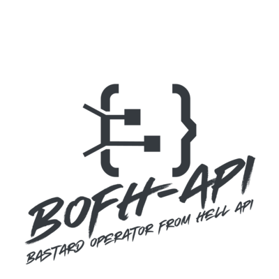

<p align="center">
  <picture>
    <source media="(prefers-color-scheme: dark)" srcset="public/logo-dark.png">
    <source media="(prefers-color-scheme: light)" srcset="public/logo.png">
    
  </picture>
</p>

<p align="center">
  453 classic BOFH excuses, served as a free JSON API.<br>
  <a href="https://bofh.bombeck.io">bofh.bombeck.io</a>
</p>

<p align="center">
  <a href="LICENSE"></a>
  
  <a href="https://monitor.bombeck.io/status/services"></a>
</p>

---

## What is BOFH?

The **Bastard Operator From Hell** (BOFH) is a fictional character created by Simon Travaglia in 1992. The BOFH is a rogue system administrator who takes out his anger on users with a wide repertoire of excuses for why things don't work. The original excuse list was compiled by Jeff Ballard.

This API serves 453 classic BOFH excuses from the original collection.

## Quick Start

**Get a random excuse:**

```bash
curl https://bofh.bombeck.io/v1/excuses/random
```

```json
{
  "data": [{ "id": 42, "quote": "Solar flares", "source": "...", "date": "..." }],
  "error": null
}
```

### JavaScript

```javascript
const res = await fetch("https://bofh.bombeck.io/v1/excuses/random");
const { data } = await res.json();
console.log(data[0].quote);
```

### Python

```python
import requests

r = requests.get("https://bofh.bombeck.io/v1/excuses/random")
quote = r.json()["data"][0]["quote"]
print(quote)
```

### Go

```go
resp, _ := http.Get("https://bofh.bombeck.io/v1/excuses/random")
defer resp.Body.Close()
body, _ := io.ReadAll(resp.Body)
fmt.Println(string(body))
```

## API Documentation

**Base URL:** `https://bofh.bombeck.io`

All responses follow the envelope format `{ data, error }`.

### Endpoints

#### `GET /v1/excuses/random`

Returns one random excuse.

#### `GET /v1/excuses/random/:count`

Returns up to `count` random excuses (1–50).

```bash
curl https://bofh.bombeck.io/v1/excuses/random/5
```

```json
{
  "data": [
    { "id": 112, "quote": "Langstroth bees rejecting null-routed wireless packets", "source": "...", "date": "..." },
    { "id": 7, "quote": "Cosmic rays", "source": "...", "date": "..." },
    { "id": 301, "quote": "Failure to adjust for stripes on ruggedized disk platter", "source": "...", "date": "..." }
  ],
  "error": null
}
```

#### `GET /v1/excuses/id/:id`

Returns a specific excuse by ID (1–453).

```bash
curl https://bofh.bombeck.io/v1/excuses/id/42
```

```json
{
  "data": { "id": 42, "quote": "Solar flares", "source": "...", "date": "..." },
  "error": null
}
```

#### `GET /v1/excuses/all`

Returns all 453 excuses.

#### `GET /health`

Health check endpoint.

```json
{
  "data": { "status": "ok", "version": "3.0.0", "uptime": 86400 },
  "error": null
}
```

### Error Responses

| Status | Meaning |
|--------|---------|
| 400 | Invalid parameters (e.g., non-numeric ID) |
| 404 | Excuse not found / unknown endpoint |
| 429 | Rate limit exceeded |
| 500 | Internal server error |

```json
{
  "data": null,
  "error": "not found"
}
```

### Rate Limiting

- **1,000 requests** per 15-minute window per IP
- Standard `RateLimit-*` headers included in responses
- `/health` endpoint is excluded from rate limiting

## Self-Hosting

### Docker (recommended)

```bash
docker run -d \
  -p 3000:3000 \
  -e ATTACKS_API_KEY=your-secret-key \
  ghcr.io/mbombeck/bofh-api:latest
```

### Node.js

```bash
git clone https://github.com/MBombeck/bofh-api.git
cd bofh-api
npm ci
npm run build
ATTACKS_API_KEY=your-secret-key npm start
```

The server starts on port 3000 by default.

### Environment Variables

| Variable | Required | Default | Description |
|----------|----------|---------|-------------|
| `PORT` | No | `3000` | Server port |
| `NODE_ENV` | No | `production` | Environment |
| `ATTACKS_API_KEY` | Yes | — | API key for internal attack detection endpoint |
| `CORS_ORIGINS` | No | `*` | Allowed CORS origins (comma-separated) |
| `LANDING_HOST` | No | `bofh.bombeck.io` | Hostname that serves the landing page |
| `SENTRY_DSN` | No | — | Sentry/GlitchTip DSN for error tracking |
| `UMAMI_URL` | No | — | Umami analytics URL |
| `UMAMI_WEBSITE_ID` | No | — | Umami website ID |
| `LOG_LEVEL` | No | `info` | Log level (debug, info, warn, error) |

## Contributing

Contributions are welcome! Please open an issue or submit a pull request.

1. Fork the repository
2. Create a feature branch (`git checkout -b feature/my-feature`)
3. Commit your changes
4. Push to the branch and open a PR

## Credits

- **Simon Travaglia** — Creator of the Bastard Operator From Hell
- **Jeff Ballard** — Original BOFH excuse list compiler
- Built by [Marc Bombeck](https://github.com/MBombeck)

## License

[MIT](LICENSE)
